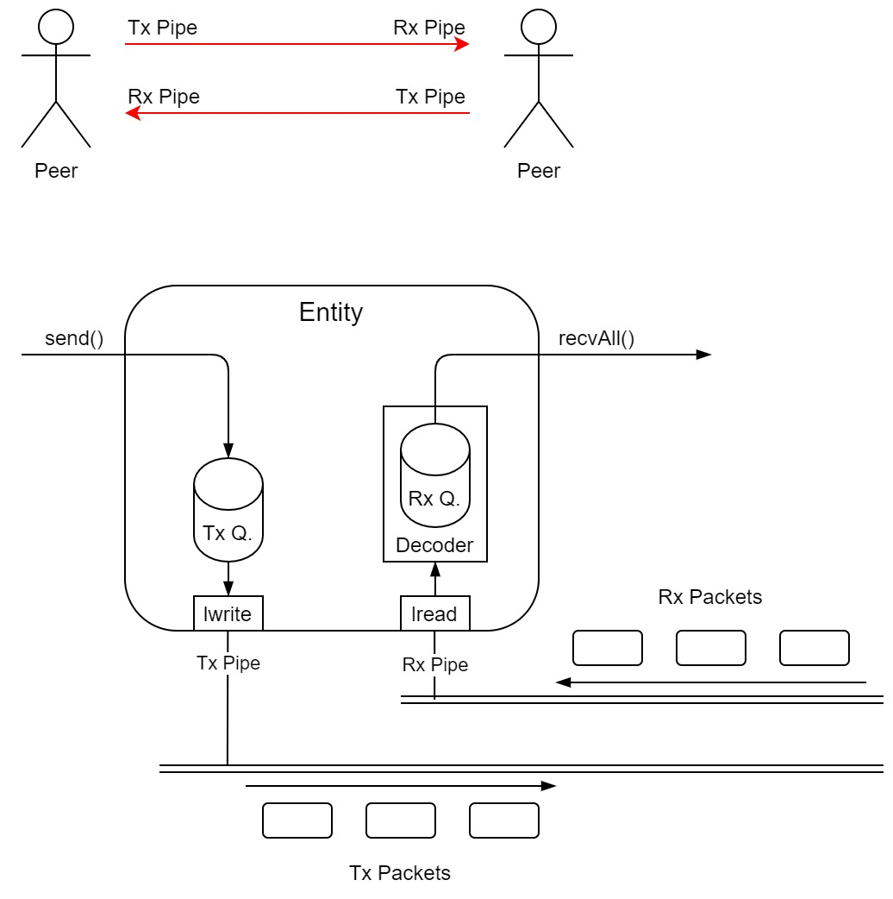

# Communication Library
A lightweight library for Packet-based P2P Communication

## Overview

<p align="center">
  
</p>

## Directory Structure
```
.
├── docs/
├── include/
├── src/
├── test/
├── tools/
├── LICENSE
├── README.md
└── CMakeLists.txt
```

* `docs`   : documentation
* `include`: libcomm headers
* `src`    : libcomm implementation
* `test`   : unit tests
* `tool`   : scripts for unit testing

## Usage
* `UdpPeer`
```
// Construct an UdpPeer
std::unique_ptr<comm::P2P_Endpoint> pEndpoint = 
    comm::UdpPeer::create(<Local Port>, <Peer/Remote IP Address>, <Peer/Remote Port>);
...

// Send a packet to Peer
udpPeer.send(comm::Packet::create(<buffer address>, <buffer size>));
...

// Check Rx queue
std::deque<std::unique_ptr<comm::Packet>> pPackets;
if (udpPeer.recvAll(pPackets)) {
    for (auto& pPacket : pPackets) {
        // do something
    }
}
...
```

* TCP Server
```
// Construct a Tcp Server
std::unique_ptr<comm::P2P_Endpoint> pTcpServer = comm::TcpServer::create(<Local Port>);
...

// Waiting for client
while (!pTcpServer->isPeerConnected()) {}
...

// Send a packet to Tcp Client
pTcpServer->send(comm::Packet::create(<buffer address>, <buffer size>));
...

// Check Rx queue
std::deque<std::unique_ptr<comm::Packet>> pPackets;
if (pTcpServer->recvAll(pPackets)) {
    for (auto& pPacket : pPackets) {
        // do something
    }
}
...
```

* TCP Client
```
// Construct a Tcp Client
std::unique_ptr<comm::P2P_Endpoint> pTcpClient =
    comm::TcpClient::create(<Server IP Address>, <Server Port>);

if (!pTcpClient) {
    LOGE("Could not create Tcp Client which connects to %s/%u!\n", <Server IP Address>, <Server Port>);
    return 1;
}
...

// Send a packet to Tcp Server
pTcpClient->send(comm::Packet::create(<buffer address>, <buffer size>));
...

// Check Rx queue
std::deque<std::unique_ptr<comm::Packet>> pPackets;
if (pTcpClient->recvAll(pPackets)) {
    for (auto& pPacket : pPackets) {
        // do something
    }
}
...
```
